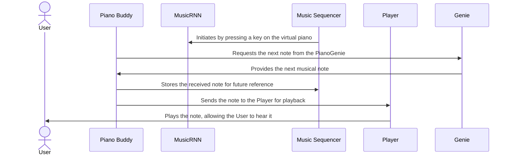
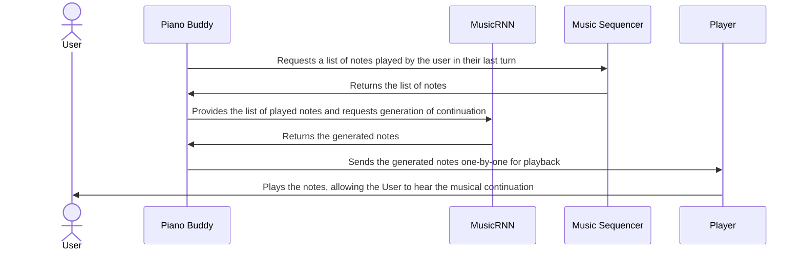

# Piano Buddy

Piano Buddy is an interactive, turn-based web application that blends user-generated piano melodies with AI-enhanced musical accompaniment. Using Magenta Music's RNN and PianoGenie, it offers a distinctive musical experience where users play the piano and the AI responds with complementary melodies.

**Live Version:** [Piano Buddy Live](https://piano-buddy-fb9180660e4f.herokuapp.com/)

## Table of Contents

- [Piano Buddy](#piano-buddy)
  - [Table of Contents](#table-of-contents)
  - [Features](#features)
  - [Getting Started](#getting-started)
    - [Prerequisites](#prerequisites)
    - [Installation](#installation)
  - [Usage](#usage)
  - [Code Structure](#code-structure)
  - [Sequence Diagrams](#sequence-diagrams)
    - [User-Initiated Melody](#user-initiated-melody)
    - [AI-Generated Melody Continuation](#ai-generated-melody-continuation)
  - [Built With](#built-with)
  - [Author](#author)
  - [Acknowledgments](#acknowledgments)

## Features

- Turn-based interactive musical experience.
- User plays piano notes, followed by AI-generated music based on user input.
- Real-time AI music generation using Magenta Music RNN and PianoGenie.
- Customizable settings for diverse musical experiences.
- Responsive design for various devices.

## Getting Started

Follow these instructions to get a copy of the project running on your local machine for development and testing purposes.

### Prerequisites

- Node.js
- npm (Node Package Manager)

### Installation

1. Clone the repository:
   ```bash
   git clone https://github.com/NastaranMO/piano-buddy.git
   ```
2. Navigate to the project directory:
   ```bash
   cd piano-buddy
   ```
3. Install dependencies:
   ```bash
   npm install
   ```
4. Build the JavaScript bundle:
   ```bash
   npm run build
   ```
5. Start the server:
   ```bash
   npm start
   ```

## Usage

Open `http://localhost:8081` in a web browser after starting the server. Begin by playing notes on the virtual piano; the AI then generates a melody based on your input.

## Code Structure

- `public/`: Contains static assets like CSS, images, and the JavaScript bundle generated from the `src` folder using `uglify-js`.
- `src/`: Source JavaScript files for the application.
- `server.js`: Sets up the Express server.
- `package.json`: Defines project metadata and dependencies.

## Sequence Diagrams

### User-Initiated Melody



### AI-Generated Melody Continuation



## Built With

- [Magenta Music](https://magenta.tensorflow.org/) - AI-based music generation.
- [PianoGenie](https://magenta.tensorflow.org/pianogenie) - Simplifies piano playing using AI.
- [Node.js](https://nodejs.org/) - JavaScript runtime.
- [Express.js](https://expressjs.com/) - Web application framework.
- [uglify-js](https://www.npmjs.com/package/uglify-js) - JavaScript compressor used for bundling.

## Author

- **[Nastaran Moghadasi](mailto:nastaran.moghadasi@gmail.com)**

## Acknowledgments

- The Magenta team for their innovative AI music tools.
